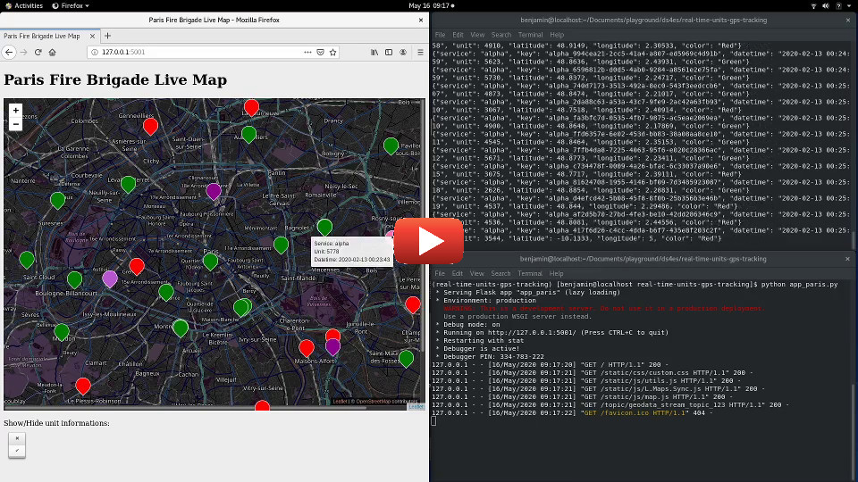

Implementation of a real-time GPS tracking service with Python and Apache Kafka. 

[](https://www.youtube.com/watch?v=1Z_MxXHya84)

For demonstration, fake GPS positionning services can be launch with the following Python scripts:

```bash
python kafka_stream_producer_london_alpha.py
python kafka_stream_producer_london_beta.py
``` 

Forked from: https://github.com/code-and-dogs/liveMaps

* **Apache Kafka** is a scalable, fault-tolerant, publish-subscribe messaging system, used for building real-time data pipelines and streaming apps. It uses Zookeeper to track status of kafka cluster nodes. It also keeps track of Kafka topics, partitions etc.
* **ZooKeeper** is a centralized service for maintaining configuration information, naming, providing distributed synchronization, and providing group services.

For MS Windows user see: [README_for_ms_windows_user.md](README_for_ms_windows_user.md)

## Install prerequisites (for RHEL 8/CentOS 8)
```bash
# Install prerequisite packages
sudo dnf install java-11-openjdk wget tmux git python3 -y
```

## Download, setup and start Kafka and Zookeeper
```bash
mkdir -p ~/kafka
# Download and extract Kafka under $HOME/kafka
curl -s ~/Downloads https://downloads.apache.org/kafka/2.5.0/kafka_2.13-2.5.0.tgz | tar -xvz --strip 1 -C ~/kafka
# To permit Kafka topic deletion
echo "delete.topic.enable = true" | tee -a ~/kafka/config/server.properties
```

Setup environment variables that will be used by the following commands for your configuration.
```bash
export BROKER_IP_ADDRESS=localhost
export BROKER_PORT=9092
export YOUR_TOPIC_NAME=geodata_stream_topic_123
```
Here we place Zookeeper, Kafka, producers apps and the consumer app under the same host that's why we set `localhost` here.

Start Zookeeper and Kafka under different tmux sessions.
```bash
# Start Zookeeper service in a tmux session
tmux new -s zookeeper-server-start -d
tmux send-keys "~/kafka/bin/zookeeper-server-start.sh ~/kafka/config/zookeeper.properties" Enter

# Hostname and port the broker will advertise to producers and 
# consumers. If not set, it uses the value for "listeners" if 
# configured.  Otherwise, it will use the value returned from 
# java.net.InetAddress.getCanonicalHostName().
echo "
advertised.listeners=PLAINTEXT://${BROKER_IP_ADDRESS}:${BROKER_PORT}
" | tee -a ~/kafka/config/server.properties

# Start Kafka server in a tmux session
tmux new -s kafka-server-start -d
tmux send-keys "~/kafka/bin/kafka-server-start.sh ~/kafka/config/server.properties" Enter
```

#### `tmux` essential commands
```bash
# To list tmux active sessions
tmux ls
# To re-open a tmux session
tmux attach-session -t <session_identifier>
# To end a tmux session
tmux kill-session -t <session_identifier>
```
## Get and start the tracking app

```bash
# Download this repo
git clone https://github.com/ds4es/real-time-units-gps-tracking
# Setup a Python environment for your app
cd ./real-time-units-gps-tracking
python3 -m venv ./env
# Activate this environment
source ./env/bin/activate
# Install requirements
pip install -r requirements.txt
```

#### Start GPS positionning providers

For London Bus data
```bash
python kafka_stream_producer_london_alpha.py
python kafka_stream_producer_london_beta.py
```
For Paris Fire Brigade data
```bash
python kafka_stream_producer_paris_alpha.py
```

For Jakarta Bus data
```bash
python kafka_stream_producer_jakarta_alpha.py
```

#### Launch the app

In another terminal, load the Python environment
```bash
cd ./real-time-units-gps-tracking
source ./env/bin/activate
```
For London Bus data map
```bash
python app_london.py
```
or for Paris Fire Brigade data map
```bash
python app_paris.py
```
or for Jakarta Bus data map
```bash
python app_jakarta.py
```


## Kafka basic commands

Create a Kafka topic
```bash
~/kafka/bin/kafka-topics.sh --create --bootstrap-server ${BROKER_IP_ADDRESS}:${BROKER_PORT} --replication-factor 1 --partitions 1 --topic ${YOUR_TOPIC_NAME} --config retention.hours=hours_to_keep_log_file
```
List all Kafka topics
```bash
~/kafka/bin/kafka-topics.sh --list --bootstrap-server ${BROKER_IP_ADDRESS}:${BROKER_PORT}
```

Check a Kafka topic information
```bash
~/kafka/bin/kafka-topics.sh --describe --bootstrap-server ${BROKER_IP_ADDRESS}:${BROKER_PORT} --topic ${YOUR_TOPIC_NAME}
```

Delete a Kafka topic
```bash
~/kafka/bin/kafka-topics.sh --bootstrap-server ${BROKER_IP_ADDRESS}:${BROKER_PORT} --delete --topic ${YOUR_TOPIC_NAME}
```

## Additional setup

#### Apache Kafka retention
We don't need any retention for our service as we only want last GPS location updates. Therfore we setup the topic retention to 0 ms. (By default the retention is set to 168 hours, cf. [Kafka documentation - log.retention.hours](https://kafka.apache.org/documentation/#log.retention.hours))  
```bash
 ~/kafka/bin/kafka-configs.sh --bootstrap-server ${BROKER_IP_ADDRESS}:${BROKER_PORT} --alter --topic ${YOUR_TOPIC_NAME} --add-config retention.ms=0
```

#### To serve under Apache
```bash
# Install Apache
sudo dnf install httpd -y

# Create directory to store your virtual hosts available and enabled
sudo mkdir /etc/httpd/sites-available /etc/httpd/sites-enabled

# Tell Apache to look for virtual hosts in the sites-enabled directory
echo '
IncludeOptional sites-enabled/*.conf
' | sudo tee -a /etc/httpd/conf/httpd.conf

# Setup your virtual host
echo '
<VirtualHost *:80>
	# Optional
    ServerName your_domain_name 

    ProxyPreserveHost On
    ProxyPass / http://127.0.0.1:5001/
    ProxyPassReverse / http://127.0.0.1:5001/
</VirtualHost>
' | sudo tee /etc/httpd/sites-available/your_domain_name.conf

# Enable it with a symbolic link
sudo ln -s /etc/httpd/sites-available/your_domain_name.conf /etc/httpd/sites-enabled/your_domain_name.conf

# Start or restart Apache
sudo systemctl restart httpd
```
The app should be broadcast under your server ip address and `your_domain_name`.

## Next step

For moving markers like Uber cars check: https://github.com/amanjeetsingh150/UberCarAnimation

## Reference
* [Kafka Documentation](https://kafka.apache.org/documentation/)